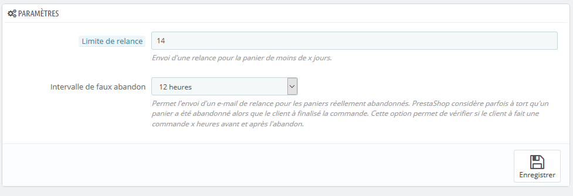
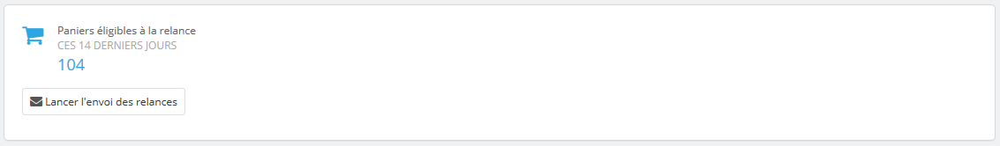
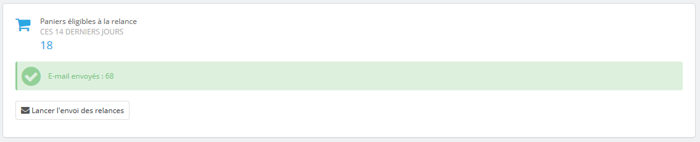
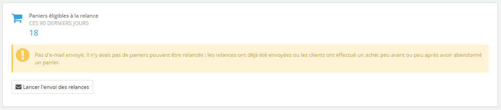
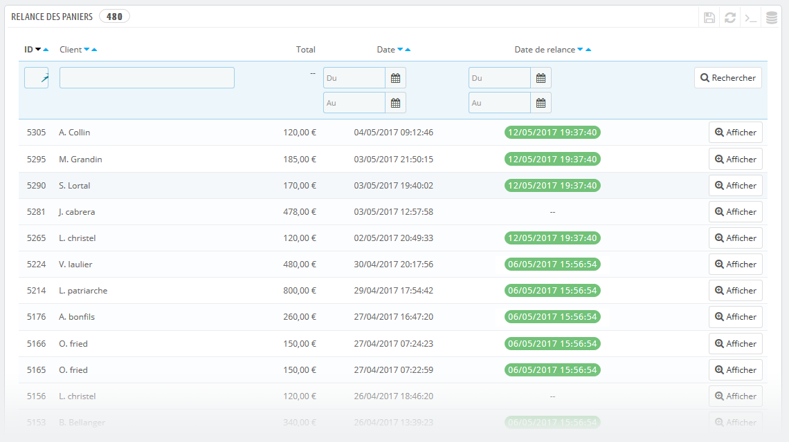

Bring the Cart Back - Relance des paniers (Module PrestaShop)
=============================================================

Ce module permet d'envoyer des e-mails aux clients identifiés n'ayant pas
terminé le processus de commande. Il relance le client via un e-mail
l'invitant à terminer sa commande 

Manuel d'utilisation
--------------------

Après avoir installé le module depuis l'onglet **Modules et Services**, un nouvel élément est disponible dans le menu du tableau de bord de la catégorie **Commandes** : **Relance des paniers**.

### Panneau Paramètres ###

#### Limite de relance (Reminder Limit) ####
Ce paramètre permet de spécifier quels paniers seront analysés depuis aujourd'hui jusqu'au nombre de jours indiqués. La relance sera faite pour les paniers ayant été abandonnés il y a moins de _x_ jours.

Si vous indiquez 14 jours, les paniers de moins de 14 jours seront analysés. S'ils vérifient la condition du paramètre suivant : l'**Intervalle de faux abandon** (False Abandonned Cart Limit) alors une relance sera envoyée.

#### Intervalle de faux abandon (False Abandonned Cart Limit) ####
Ce paramètre permet de vérifier que le client n'a pas fait de commande dans
l'intervalle spécifié (avant et après). Cela évite de lui envoyer un mail de relance alors qu'il a finalement commandé chez vous avant ou après avoir abandonné le panier.

PrestaShop considère parfois à tort l'abandon d'un panier lorsqu'une commande a
échoué par exemple et en recrée un autre. Cela a pour conséquence de fausser le
nombre réel de paniers abandonnés.
Ce paramètre permet d'y palier en indiquant un intervalle de _3h_, _6h_, _12h_, _24h_, _48h_ ou _72h_.

Par exemple un panier est abandonné le **06/06/2017 à 14:40** et un autre est créé pour le même client qui finalise sa commande **2 heures** après.
L'outil va vérifier qu'il n'y a pas eu de commande avant et après l'abandon selon l'intervalle spécifié.
En considérant que l'intervalle choisi est de **3h**, il ne recevra pas de relance.
Cependant, s'il effectue la commande 4h plus tard il recevra tout de même une relance.
Dans ce cas il est judicieux d'adapter ce paramètre selon le comportement habituellement constaté de vos clients.

### Panneau Statistiques et lancement des relances ###

#### Paniers éligibles à la relance ####
Cette section affiche les paniers éligibles à la relance sur les x jours spécifiés dans le paramètre Limite de relance. Il n'indique pas nécessairement que tout ces paniers seront relancés. Pour qu'ils le soient il devront satisfaire à la règle **Intervalle de faux abandon**.

#### Lancer l'envoi des relances ####
Ce bouton permet d'actionner manuellement les relances à partir des paramètres
spécifiés plus haut.

Après avoir actionné ce bouton et que le processus de relance sera terminé, des
informations concernant le nombre de mails envoyés est affiché.

#### Liste Relance des paniers ####

Ce tableau représente la liste des paniers abandonnés et dont les utilisateurs
ont été authentifiés. Autrement dit, il s'agit des paniers potentiellement
récupérables avec une relance. Il peut y avoir des doublons dans la même journée
et un seul mail sera envoyé si le client n'a pas effectué de réelle commande
suite à cet abandon.

**Colonnes** :
* **ID** : l'identifiant unique du panier
* **Client** (Customer) : Initiale du prénom et nom de famille du client
* **Total** : valeur totale du panier
* **Date** : date et heure de création du panier
* **Date de relance** (Reminder date) : date d'envoi du mail de relance
* **Afficher** (Show) : affiche de plus amples informations sur le panier